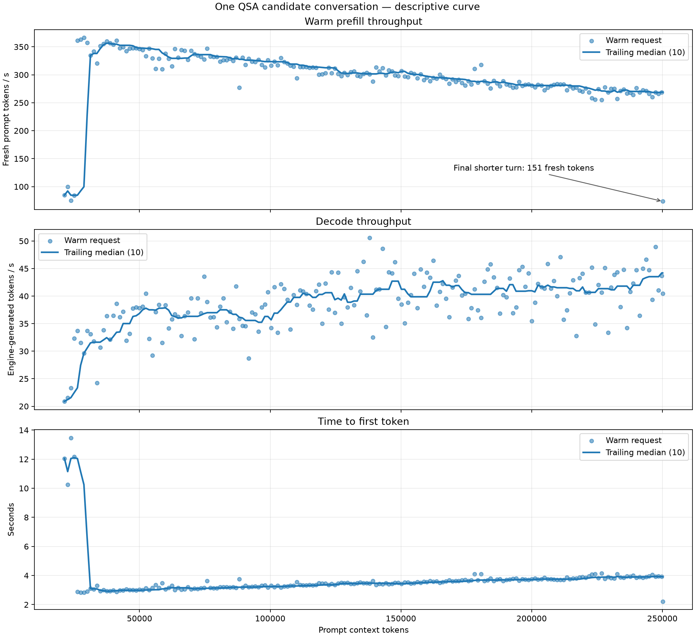

# Validated0.1.38 SM75 source, 3 October2026

Upstream main `99f3dbd0b21d1401b3769e0c0d963913607f380b`, automatic elastic expert cache, SM75 HC/GDN FP16 and vector
dequantization ports, serial intermediate quantization, conservative optional
`--prompt-cache-tail` ([PR614](https://github.com/Niko1221/Strata/pull/614)), and wide
top-k ([PR603](https://github.com/Niko1221/Strata/pull/603), exact pinned source).
The old checkpoint grid is removed, including its chunk-boundary overrides.
The old failed grid comparisons remain in the research record; this replacement
does not turn those failures into passes.

Full fresh CMake/Ninja Release build, CUDA12.6/MSVC14.44, architecture75.
Six CTest checks pass; native CPU quantization64 cases bitwise; wide top-k18 cases,
continuous scores, ties and equal scores, prompt/decode through524288 cells;
118 upstream server mock tests pass. A fixed-placement old036/new038/old036
model comparison has2560 teacher rows (2557 scored positions) per arm, finite
logits, six complete recall oracles, and all local numerical gates pass.
Separate Daily auto/elastic conversations at131072 and250000 input tokens pass
six oracles, with1024 generated tokens at each depth and a new marker afterwards.

Controlled PR603 comparison at250000 actual tokens: same038 source,5357 expert
slots,8192 prefill chunk, spec4, KV 262144/int8/resident 32768, resize disabled by
real long policy intervals. A/B/A repeated baseline; first logits are bitwise
identical and every complete recall/marker oracle passes. Detailed timings and
the distinction from the automatic Daily profile are in `validation.json`.

Only the modified22GB RTX2080Ti, Ryzen5800X/AVX2 and96GB RAM were exercised.
No artificial system saturation, general quality score, physical DRAM-bandwidth
measurement, stock11GB or multiGPU performance claim.
Executable SHA256: `014d7773886a45b10072cf362cf01082ec048a9063b318e3cd1ff024b3beaf71`. Previous manifests and validation remain intact.

| Actual fresh input | Fresh prefill t/s | Long decode t/s | Output tokens |
|---|---:|---:|---:|
| 131072 | 1027.01 | 36.913 | 1024 |
| 250000 | 833.50 | 39.065 | 1024 |

Single automatic-profile samples: initial6339 expert slots, runtime spec6,
MTPmax4/lookup3/PCIe0.36. They do not establish a causal gain against old036.
Controlled PR603250k prefill A/B/A: 701.49/832.03/699.49t/s,
+18.78% relative to the baseline mean, reference spread0.29%.
This fixed5357slot/8192chunk/spec4 profile has MTPmax0/lookup0/PCIe0.28;
keep it distinct from the automatic Daily profile above. Only one A/B/A.

## Historical records (their original versions and limits apply)

# Quality follow-up, 2 October 2026

[Native IQ quality regression](QUALITY-0136.md): A/B/A full logits are
byte-identical on 2,557 scored positions, and all three 131k retrievals pass.
The combined answer gate fails on one arithmetic question in every arm;
it also fails without drafts, and passes with reasoning enabled. The failed
verdict is retained. These are controlled quality runs, not a new SOTA.

# Main aligned to upstream 0.1.36, 2 October 2026

Current source base: `36fa455e579b23a9c909c2c6fe1bddd9e51cb8ca`. The tested SM75 executable SHA256 is
`c35505ca79b790bd37ed7073fcadd399dd30d1b88e85bb99a6eb24a52d945d0a`. Windows, modified RTX2080Ti22GB, Ryzen5800X/AVX2, 96GB RAM,
CUDA12.6, IQ3_XXS, KV 262144/int8/resident 32768, reserve1393MiB, automatic elastic
cache, MTP. Two requests per arm: fresh131248 tokens, then131239 with131072
reused; 1024 output tokens each. No artificial saturation.

| Engine | Fresh 131k prefill t/s | Aggregate decode t/s | Initial elastic slots |
|---|---:|---:|---:|
| 0.1.31 reference | 974.05 | 41.255 | 6592 |
| 0.1.36 serial (daily) | 972.68 | 40.123 | 6786 |
| 0.1.36 parallel quant (opt-in) | 970.60 | 40.272 | 6034 |

These are single sequential samples with real desktop activity, changing cache
and MTP acceptance. They do not establish a causal gain from either upstream
changes or parallel quantization. The daily keeps serial quantization; the
parallel implementation is available for explicit controlled comparisons.
16 top-k cases pass bitwise; the unchanged pool port retains 64 real-GGUF
serial/parallel cases; the CMake-built HC test has zero failures. All100 upstream
server mock tests pass. General model quality and a new250k retrieval are not
covered by this comparison. Historical 0.1.31 evidence follows, including its
separate top-k A/B/A and250k retrieval; those measurements do not describe the
new executable.

# Measured daily:2 October2026

Modified RTX2080Ti22GB, Ryzen7 5800X,96GB RAM, Windows/CUDA12.6, PCIe3.0,
IQ3_XXS, KV 262144/int8/resident 32768, reserve1393MiB, automatic elastic cache,
automatic prefill, spec4/min-p0.5, MTP. Normal desktop activity remained;
no artificial saturation. JumpConnect sampled CPU was zero in retained runs.

## Same-executable top-k A/B/A

Prompts131248 and131239 per run; the second reused131072. Each generated1024
tokens. Only the dispatch override changed.

| Run | Dispatch | Fresh prefill tokens/s | TTFT s | Aggregate decode tokens/s | Initial slots |
|---|---|---:|---:|---:|---:|
|A1|capacity|831.20|158.509|38.251|6537|
|B|active|886.38|148.664|39.272|6524|
|A2|capacity|828.26|159.092|39.293|6872|

Mean reference829.73, candidate886.38: **+6.83%**, reference spread0.35%.
Mean TTFT158.801→148.664s:10.137s saved. Previous exact daily independently
measured827.53prefill/39.048decode. This is one retained A/B/A; elastic slots
and MTP output vary. B/A2 decode is virtually identical. See `validation.json`.

## Retrieval and deep decode

Needles at10/50/90% were all FOUND, real tokens30742/30742/30743. The tool's
"32k" label estimates characters; use these actual counts.

The exact250k fixture: **250022 tokens**, zero reused, needle at50%, correct
13-token answer,391472.7ms prefill (**638.670tokens/s**). That short answer is
not the decode benchmark.

The follow-up:250091 prompt,250015 reused, **1024 generated to finish length**,
251115 total. Decode26110.5ms = **39.217939tokens/s**;76 fresh prompt tokens in
1317ms. MTP583/944 drafts accepted, expert cache88.3%, KV blocks95.09% fromVRAM.

131k/250k use different prompts and acceptance, so these are observed context
points rather than a controlled sweep of one prompt. The previous250k result
442.4prefill came from another time window: the difference from638.7 cannot
be attributed entirely to the top-k fix, which affects only the initial135k.

## Numerical limits

- 16top-k cases:stride65538, batch1/8/255/256/257, partial tails, zero/tied scores,
  register limit33792/fallback33793, context up to262144. IDs bitwise equal.
- First131k logits:248320 finite values, same argmax1596. Even A/A model logits
  differ: this does not validate general model quality.
- Retrieval/deep-decode logit captures finite. HC/GDN FP16 changes precision;
  numerical checks and retrieval coverage are limited validation.
- Physical DRAM throughput not measured: Nsight Compute reported
  ERR_NVGPUCTRPERM. NVML memory activity is not measured GB/s.

## Reproduction

Original commands, fixture hashes, native logs and tools:
[full research record](https://github.com/imanu86/moe-aggressive-commit/blob/research/ds4-iq1-subbit-tier-planner/docs/porto/strata_adattivo/RISULTATI_TOPK_2_OTTOBRE.md).

`tests/sm75/topk_active.cpp` is the deterministic native bench. Link against
the fork's kernels/core and CUDA runtime; pass context, query count, score mode:

After an explicit engine build, from an x64 VS2022 Developer PowerShell:

```powershell
cl /nologo /std:c++20 /EHsc /O2 /MD /Iinclude /I"$env:CUDA_PATH/include" `
  tests/sm75/topk_active.cpp /Fo:build-sm75/topk_active.obj /Fe:build-sm75/topk_active.exe `
  /link build-sm75/strata_kernels.lib build-sm75/strata_core.lib `
  "$env:CUDA_PATH/lib/x64/cudart.lib" "$env:CUDA_PATH/lib/x64/cudadevrt.lib"
```

Run it from `build-sm75/` with the CUDA runtime on PATH:

```text
topk_active.exe 131072 256 0
topk_active.exe 135164 256 0
topk_active.exe 135168 256 0
topk_active.exe 131072 256 1
```

Mode0=random,1=zero,2=ties,3=bound0,4=bound above stride. Numerical/model tests
consume GPU time and are explicit actions. No new GPU test was run for
publication. The previously installed exact daily passed startup in42.84s at
KV262144, then stopped. Local publication checks cover source/config only;
this fork has no automated workflow.


## Incremental prompt tokenization, 3 October 2026

Community [PR567](https://github.com/Niko1221/Strata/pull/567), pinned at
`f29e527856b85e37bda90626ccc28e002b4989dd`, reuses tokens up to a safe special-token
boundary in a shared rendered prompt. Only the remaining text runs through BPE.
The two production Python files and the upstream tests are ported unchanged.

Validated on Windows, Ryzen 7 5800X, 96 GiB RAM, with OktoCGControl open. CPU only,
no artificial load. The real IQ3_XXS pack vocabulary, merges and chat template
were used on all 187 prompts of the 20,001 -> 250,012-token conversation.
Full encoding from the installed pre-patch server was compared with the new
incremental encoder on every prompt: **25,306,163 input token IDs, all equal**.

| Actual context window | Turns | Full encode, median | Incremental, median |
|---|---:|---:|---:|
| 125k-135k | 8 | 434.1 ms | 7.77 ms |
| 240k-250,012 | 9 | 931.9 ms | 10.57 ms |

This measures the tokenization component before the native engine. It does not
measure end-to-end chat TTFT, change GPU prefill/decode, or establish a new SOTA.
There is one chronological replay; each turn runs full encoding then incremental
encoding in the same process. First prompts and unrelated prefixes still need
full encoding. Rendering and HTTP transfer costs are outside this table.

`python -B -m unittest tools.test_strata_tokenizer serve.test_server -v`:
132 tests run, 131 passed, one skipped (llama.cpp reference vectors unavailable).
`STRATA_TOKENIZER` points to the actual pack, so real-vocabulary prompt tests ran.
Coverage includes shared/edited/shortened prompts, tools, images, overlapping
special tokens, mock-engine HTTP requests, and tokenizers without resume points.

[Per-turn counts, hashes, timings and validation metadata](incremental-prompts-20261003.json)
retain the evidence without publishing the full local transcript. The native
Daily executable remains SHA-256
`13ee1a89be497ad83c67f62553b1133fec2a8d9309230d43a9dae639d89008a5`.
The historical source manifest stays intact; the installed frontend has a
separate overlay manifest and a backup of the replaced files.


## Request-sized routed buffers, 3 October 2026 (experimental)

`STRATA_PREFILL_EXACT_SMALL=1` keeps the buffer layout below the streaming
threshold when the actual prompt segment is below it. The default is **off**.
A 1007-token batch previously borrowed buffers for 1024 tokens, including the
large streaming ring, but still executed the routed path (threshold1024).
The opt-in uses a1007-token layout: **517 cache slots lent instead of1033**,
leaving516 more experts resident during that batch. KV capacity is unchanged.
The rounding of other requests remains unchanged; the helper is shared by the
native serve and CLI paths and observes `STRATA_PREFILL_STREAM_MIN`.

Windows, modified22GB2080Ti, Ryzen5800X,96GB RAM, CUDA12.6/SM75, IQ3_XXS,
OktoCGControl open, no artificial load. Same executable, profiling off, native
pipe with trace and first-logits dumps. Fixed6167 resident experts (10218MiB),
KV int8 capacity262144/resident32768, spec4,7 workers, adaptive swaps and PCIe
fraction off for the paired laboratory checks. This fixed cache is not a Daily
configuration change.

The standalone C++ boundary/property test passed519268 checks. Eight real-token
slices exercise actual batched sizes256,768,769,1007,1023,1024,1025,1536.
The short comparison completed in order off/on/off (A1/E/A2):

| Batched tokens | Base A1 / A2 prefill ms | Exact buffers ms | t/s change vs mean base ms |
|---|---:|---:|---:|
| 256 | 1279.2 / 1295.9 | 1281.7 | +0.46% |
| 768 | 2006.4 / 1989.4 | 2026.0 | -1.39% |
| 769 | 2186.7 / 2201.7 | 2043.5 | +7.37% |
| 1007 | 2336.1 / 2324.9 | 2196.2 | +6.12% |
| 1023 | 2455.4 / 2448.5 | 2341.9 | +4.70% |
| 1024 | 2813.8 / 2821.5 | 2816.2 | +0.05% |
| 1025 | 2833.9 / 2848.5 | 2830.6 | +0.37% |
| 1536 | 2868.4 / 2924.6 | 2876.4 | +0.70% |

Times include the final input token (for example1008 input tokens for a1007
batch) and cache refill. These are short-context samples, not130k/250k chat
throughput or a new cold-prefill SOTA.

The completed long-context A1/E pair used real continuation fixtures:

| Total input | Fresh input | Base A1 ms | Exact ms | Interpretation |
|---|---:|---:|---:|---|
|130380|1014|3873.1|3713.9|Single pair, performance not confirmed|
|249322|1014|4357.9|4363.1|No observed gain|

Both final long control attempts became unusually slow during cold prefill and
were stopped before completing a request. The original result files remain
failed; their timings are excluded. A later smoke using the actual elastic
Daily configuration also slowed in its first cold chunk and was stopped.
Startup had6426 slots and1001MiB free; loading39.97GiB took about146s overall
(arena0.37GiB/s), compared with about32s overall in faster starts. One snapshot
of the first slow control found620MiB VRAM free and normal GPU clocks. Cause
is **unresolved**; this is not evidence that OktoCGControl or the patch caused it.
The operational smoke did not pass. **Native Daily and its configuration remain
unchanged; this feature is not promoted.**

Numerical evidence is separate from those inconclusive long timings. All248320
first-target logits match bit for bit for each of the8 short cases and4 completed
long requests (two seeds and two continuations). The generated greedy token IDs
also match:64 short and66 long,130 total per A1/E comparison. Maximum absolute
logit difference and KL are both zero. This checks allocation/copy equivalence
on these fixtures; it is not a broad model quality/PPL evaluation. Other GPUs,
stock11GB cards, and multi-GPU operation have not been validated.

An exploratory8-slot grouped-gather variant also matched numerically but showed
no gain in the usable short pairs; its final baseline was anomalously slow.
That variant was removed before the final build. It is not shipped here.

Reproduction: build `prefill_request_chunk_test` with `STRATA_BUILD_TESTS=ON`
and run `ctest -R prefill_request_chunk_test`, or compile the standalone test
with the repository include directory. For model comparisons, restart the same
binary with `STRATA_PREFILL_EXACT_SMALL=0` and1, keep inputs/residency/settings
fixed, and repeat the reference. `STRATA_DUMP_FIRST_LOGITS=<absolute-prefix>`
now works for native `--serve`: each request writes the first target row to
`<prefix>.pos<last-input-position>.f32` (float32). The existing CLI dump format
is unchanged. Dumps are opt-in and no raw transcript or weights are published.
[Hashes, per-case timings, parity and excluded runs](request-chunk-20261003.json)
retain the measured evidence. Resolve the long-run instability and repeat the
actual-config smoke before enabling the flag in the operational profile.


### Single B repeat after the anomalous runs

At the user's request, only the candidate was repeated, once. It completed all
four requests in **372.2 s including startup**, without the earlier slowdown.
Executable, CLI arguments, input fixtures and expert-profile hashes match the
interrupted operational candidate. Automatic elastic cache started at6342
experts /10512MiB, with1137MiB free. KV remains262144/int8/resident32768.

| Actual context | Fresh input | Prefill | First token, native pipe |
|---|---:|---:|---:|
|130380|1014|279.6 tokens/s|3.702 s|
|249322|1014|248.5 tokens/s|4.193 s|

The initial129366-token cold prompt ran at937.1 tokens/s. The later preparation
of248308 total input reused130373 tokens, so its639.4 tokens/s over117935 new
tokens must not be called a cold248k result. Each continuation generated32 tokens
(25.4 and33.6 tokens/s); these short samples are not long-decode SOTA measures.
All four captured logit rows contained248320 finite values. This single B does
not add a paired numerical comparison or establish a causal long-context gain.

As in the previous candidate test, the harness uses `STRATA_IQ_MT_MIN=1` for
consistent CPU rounding across draft widths (the engine default is2), alongside
trace/first-logits diagnostics. Thus these are the Daily CLI/cache settings with
the stated benchmark overrides, not a claim of unmodified Daily decode speed.
In64 lightweight process/CPU/I/O samples there were no detected compiler
processes; median CPU use was22%, minimum available RAM22.9GiB. This documents
the repeat's conditions, not the cause of the earlier anomalies. Those records
are preserved. No additional A or B was run; the engine was closed afterward.
The installed Daily and default-off flag were left unchanged in this test-only
step. [Repeat evidence and hashes](request-chunk-B-repeat-20261003.json).


### Completed controls and HTTP follow-up

The delayed fixed-cache A2 completed in 372.8 s with 6167 slots (10218 MiB).
All four first-logit rows (248320 floats each) and 66 generated IDs match A1/B
bit for bit. A2 followed intervening runs; this is not an uninterrupted A/B/A.
Original stalled attempts remain recorded, with their cause unresolved.
The numerical bench forces IQ_MT_MIN=1, unlike the normal Daily environment.

| Actual input | Fresh tokens | A1 ms | B ms | Delayed A2 ms | B vs control mean |
|---|---:|---:|---:|---:|---:|
|130380|1014|3873.1|3713.9|3840.9|+3.85%|
|249322|1014|4357.9|4363.1|4359.2|-0.10%|

An elastic A also completed after B: observed warm gains 4.10%/3.00%, with
6342/6347 startup slots. These are not fixed-placement causal gains. At 249k,
first logits differ (same argmax), and generated IDs first diverge at token 28.
Do not describe this as elastic bitwise parity.

The local Daily enables exact-small; the engine default stays off. The original
manifest is preserved, with separate binary/config/source backups and overlay.
Actual-environment HTTP checks used no IQ_MT_MIN, trace, profiler or logits dump:

- With cap 128, both exact-small on and off complete 11 requests to about 30k.
  After the first two length-capped responses, later outputs increasingly end
  mid-sentence despite native `stop`. This behavior is not specific to the patch;
  its cause is not established by these different sampled conversation histories.
- With cap 512, nine responses of 184–259 tokens finish with complete sentences.
  The harness then fails to size the next prompt (target 30008, minimum 30176).
  This is a partial run to 29854 input tokens, not a completed 30k test or a broad
  answer-quality pass. The original failed result is retained.
- First prefill varied from 18.24 s to 214.68 s and 196.03 s across these HTTP runs.
  The slow runs are excluded from speed claims, and their cause is under review.

No new cold-prefill or sustained-decode SOTA is claimed.
[Hashes, measured rows and limitations](request-chunk-final-20261003.json).


## 2026-10-03: main-model BF16 tensor-core experiment rejected

A local adaptation of [rafatxf's PR655](https://github.com/Niko1221/Strata/pull/655)
converted the remaining main-model BF16 products through FP16 on SM75, preserving
the MTP draft path and reusing existing scratch. It passed the bounded kernel tests
but failed the predeclared paired model gate at 20,001, 130,380 and 249,000 tokens
(256 teacher-forced positions each). The off/on/off baseline repeat was bitwise
identical at all three depths. Top-1 agreement with the candidate was respectively
97.27%, 98.44% and 94.92%; these are agreement rates, not semantic accuracy scores.

The experimental source was removed before the next build and was never enabled
in the Daily. No end-to-end speed claim is made. This is a result for our local
adaptation, not a verdict on the unmodified upstream PR. Configuration, thresholds,
raw hashes and per-depth metrics are in [the rejection report](bf16-main-rejected-20261003.json).


## Grouped-query QSA prefill (4 October 2026)

This default-off `STRATA_QSA_PREFILL_MULTI=1` path reuses each FP32 key block for
up to eight prompt queries on SM75. It extends q8atnight's
[PR187](https://github.com/Niko1221/Strata/pull/187) to bounded prompt batches;
per-query arithmetic and the decode path are unchanged. The measured card is a
modified 22 GB RTX 2080 Ti, with Ryzen 7 5800X, 96 GB RAM, CUDA 12.6 and PCIe 3.0.
Stock 11 GB cards and multi-GPU operation are unvalidated.

The 12-case synthetic suite checks complete score/selection buffers: query counts
7/8/9/256/1007/8192, small/large/tail/cap shapes, ties, non-finite inputs, and the
unspecified active-bound fallback(-1). All comparisons are byte-identical.
A same-binary off/on/off model gate also passes: all four 248320-value first-logit
rows are finite and bitwise identical, and all 258 output IDs per arm match.
These are bounded regression checks, not a broad semantic-quality evaluation.

The model gate uses KV 262144/int8/resident32768, fixed 6167 expert slots/10218 MiB,
spec 4, suffix drafts off, exact-small on, and default IQ_MT_MIN 2 (no override).
First-logit dumping occurs after native prompt_ms; it affects decode/wall time.

| Actual context | Fresh / reused | A1 prompt ms | B prompt ms | A2 prompt ms | Throughput gain vs control mean |
|---|---:|---:|---:|---:|---:|
|130380|1014 /129366|3722.0|3520.2|3697.0|5.38%|
|249322|1014 /248308|4233.5|4000.3|4268.0|6.26%|

The gain is `(mean(A1 prompt_ms, A2 prompt_ms) / B prompt_ms - 1) * 100`.

The full-fresh 129366 request took 325.298/130.794/417.148 s in A1/B/A2.
The large control spread remains unexplained and cannot establish a causal cold
speedup. The 248308 request reuses 130373 tokens, so it is not a cold 248k measure.
Additional group/grid tuning passed parity but showed no consistent winner;
one anomalous 8x64 case was repeated once and remained slower. It is not shipped.

A separate real HTTP conversation completed 190 turns, from 20002 to 250130 input
tokens, in 2017.73 s including startup/cleanup. It uses the Daily automatic/elastic
configuration, KV 262144/int8/resident32768, CLI spec 4 with adaptive policy,
exact-small and QSA enabled, and no IQ override, trace, logits dump or profiler.
Each user follow-up targets 1000 tokens, with a shorter final turn. Temperature 0.6,
top_p 0.95/top_k20, thinking off, output cap 512. All requests report stop.
The first cold 20k prefill took 214.342 s (93.3 t/s). Turns 2-5 were also slow, then the
same process recovered without changing flags. All warm observations are retained.

| Warm context band | Requests | Aggregate fresh prefill t/s | Aggregate decode t/s | Median first-token s |
|---|---:|---:|---:|---:|
|20-50k|24|230.6|31.5|2.99|
|50-100k|40|328.2|36.1|3.16|
|100-150k|41|307.5|39.8|3.42|
|150-200k|41|290.3|40.6|3.64|
|200k-end|43|269.6|41.0|3.86|

Across all 189 warm turns: 286.5 prefill/38.0 decode t/s. Initial slow turns remain
included. The final 151-fresh-token request has 73.7 prefill t/s and 2.218 s first
latency; its smaller batch is not comparable to a 1k turn. The nearest full-sized
turn and final turn are recorded separately. No causal comparison to the earlier
187-turn trace or new cold/decode SOTA is claimed.

The API cache count 6420 is a startup snapshot. Native-log counts at request end
range 6618-6878; they document resize decisions, not physical residency. The CSV
labels these fields separately. Manual reading of sampled outputs found complete
sentences but repeated stock reasoning and unsupported technical claims. This
conversation is continuity/performance evidence, not a semantic-quality pass.



[SVG](qsa-chat-20261004.svg), [per-turn CSV](qsa-chat-20261004.csv), and
[hashes, controls, settings and limitations](qsa-prefill-multi-20261004.json).
No private conversation text or raw token IDs are published.

Reproduce the synthetic gate with a CUDA SM75 build and runtime libraries on PATH:

```text
cmake --build build --target qsa_prefill_multi_parity
python tests/cuda/qsa_prefill_multi_check.py --exe build/qsa_prefill_multi_parity.exe --out qsa-check --run
```

Omit `--run` for the CPU-only dry-run. The explicit GPU target is not added to
automatic CTest execution. The portable runner itself was executed successfully:
12 cases, 26 processes, full-buffer equality, unchanged executable hash. Its later
timings are only reproducibility evidence. Selected model executable SHA256:
`aefbde27309d3a16ca02ba1ab67ff62ea71c80275af993a2026db67ae66a0177`.

### Extended teacher check: partial, not a full pass

A later off/on/off check planned 256 teacher-forced positions at each of 130380
and 249000 tokens per arm, using the same QSA binary and fixed 6167-slot profile.
The work deadline interrupted A2; elapsed time was 1712.984 s. It captured 1456
of 1536 planned full rows: A1 and B have 512 each; A2 has 256 at 130380 and 176
at 249000. Independent byte, finiteness and per-row hash checks find A1/B equal
at all 512 positions, with A2 equal at all 432 common positions. The missing 80
A2 rows prevent a complete extended-gate PASS. These observations do not support
a semantic-quality or performance claim. [Coverage and hashes](qsa-teacher-partial-20261004.json).


## Optional HtoD and PLE diagnostics (4 October 2026)

Two four-arm checks at 20001 and 21015 input tokens pass full first-row F32
bitwise parity and generated-ID equality. The first compares the original
binary with counters disabled/enabled; the second adds PLE snapshots and one
`--ple-sync-submit` arm. Both use fixed6167 slots, KV262144/int8/resident32768,
spec4, QSA/exact-small enabled, default IQ_MT_MIN2 and timing events. These are
diagnostic runs, not pure throughput or broad quality tests.

The counted primary-ring expert copies are 110833920000 bytes for the cold
20001 request and 33418368000 bytes for the 1014-fresh-token follow-up, all direct
from pinned memory in this fixture. The latter uses two batched chunks across a
checkpoint/turn boundary; it is not a one-chunk elastic HTTP turn. Dividing by
prompt wall time is not an instantaneous PCIe or VRAM bandwidth measurement.
The counters cover 19994 and 1013 batched tokens respectively; native fresh-token
counts are 20001 and 1014. Final-token verification is outside these counters.

The first gate retained a 211.984-second cold outlier: host PLE time was193044ms,
against693ms in its19.087-second control. The same candidate binary subsequently
ran the cold request in19.208 seconds. This localizes waiting to the PLE path but
does not identify a disk, worker, GPU-clock or synchronization cause. CUDA phase
intervals spanning host gaps must not be described as kernel execution time.

PLE read counts and wait/submit totals are cumulative. Read p50/p99 reflect the
most recent up to65536 completed reads; subtracting percentiles is invalid.
`--ple-sync-submit` also disables the existing keepalive, so that arm changes
more than worker scheduling alone. The operational I/O policy is unchanged.
The diagnostic flag remains off by default. [All measured arms and hashes](prefill-diagnostics-20261004.json).

### Actual Daily: full-history recall and arithmetic

The installed diagnostics binary (SHA256 below), with statistics disabled and
the unchanged automatic/elastic Daily configuration, completed two HTTP requests
over the full 190-pair history. Both use temperature 0 and cap 1536. The first
answer is not appended to the second request; no history is truncated.

| Thinking | Rendered prompt tokens | Reused | Completion tokens | Native prompt s | Automatic JSON oracle |
|---|---:|---:|---:|---:|---|
| off | 250487 | 0 | 52 | 293.332 | FAIL: GPU-name suffix |
| on | 250523 | 0 | 306 | 407.485 | PASS |

Independent reading confirms all five requested facts in both final answers:
GPU, 22 GB VRAM, KV capacity 262144, resident KV 32768, and the margin calculation
`262144 - 250130 - 512 = 11502`. The first names the GPU `RTX 2080 Ti modificata`;
the predeclared literal validator rejects that suffix. Its original FAIL is
preserved separately from the manual factual assessment.

Elapsed time including startup and cleanup was 989.66 s; HTTP readiness took
274.74 s. Initial automatic cache: 7082 slots, runtime spec 6 (CLI spec 4 with
adaptive policy). Both requests read their full rendered prompts. These single
observations, with intermittent stalls and variable elastic cache, are not a
causal timing comparison between thinking modes or a new SOTA. Facts also occur
in earlier assistant responses: this is a five-field check, not a hidden-needle
or general semantic-quality evaluation. All pinned inputs stayed unchanged and
the owned processes closed. [Sanitized result and hashes](qsa-daily-recall-20261004.json).

Installed Daily executable SHA256:
`a17d0dd5362bc35420ca9ef3d1a8cf8c014dafbb3aea189c6c664fe7930e8674`.


## Decode PLE timing and PCIe screening (4 October 2026)

The default-off `STRATA_DECODE_TIMING` diagnostic now measures the primary
verifier's PLE gather (submit, wait and dequantization, excluding n-gram keys).
It is a subset of host staging. The residual is not separate source attribution,
and the primary-verifier counter is not an aggregate across multiple GPUs.
Cumulative reader counts/blocked time can be differenced; rolling p50/p99
must not be subtracted as request-local percentiles. Leave the flag unset to
disable it, including on Windows (setting it to 0 still enables it).

Old executable / candidate off / candidate on pass three full first-logit
rows at 4163, 9283 and 20480 input tokens (248320 finite F32 values per row)
and 384 generated IDs per arm, bitwise. These are 128-token prefixes, not
complete answers or a throughput comparison. PLE gather in the ON arm takes
0.849/0.758/0.457 ms per window, with 0.002 ms residual staging. The earlier
intermittent 30–33 ms staging cost was not reproduced here.
These numerical arms use 5080 actual cache slots / 8442 MiB, PCIe share 0,
spec 4/MTP max 4, with elastic/adaptive swaps, suffix and prompt caching off.
They do not establish full-answer parity under the operative elastic policy.

**Initial decision: not installed in Daily.** A separate smoke using the operative automatic,
elastic and tail settings finishes its 9283-token LRU task but fails the exact
answer oracle: hits 1 / misses 13 instead of hits 2 / misses 12. Valid JSON
and throughput do not establish correct output. The old Daily reference passes
the complete-answer oracle. Initial automatic cache allocations differ (5849
candidate slots, 6014 reference slots), and full generated token sequences
differ. This pair alone does not isolate a code regression.
The operational executable remains `a17d0dd5…`; config, launcher, source
snapshot and historical manifest are unchanged. No new SOTA or release.

The separate PCIe-share study warms three tasks and runs A/B/A in one process:
A=0.36, B=0.55; workers 7, spec 6/MTP max 4, suffix/adapt/elastic off.
Auto sizing at startup gives 5732 slots/9503 MiB cache, 1639 MiB free with
reserve 2048. Prefill still borrows slots: placement is not fully frozen,
and this is not an operational elastic-profile comparison.

| Rendered input | A1 decode t/s | B decode t/s | A2 decode t/s |
|---:|---:|---:|---:|
| 4163 | 38.422 | 28.656 | 36.875 |
| 9283 | 38.082 | 28.363 | 38.851 |
| 20480 | 38.362 | 31.905 | 36.821 |

Higher share is rejected: all three tasks slow down. First/third control
pairs also drift about 4.1%, beyond the predeclared 3% stability bound, so
these are screening observations, not precise general regression estimates.
All eight arithmetic/LRU requests pass exact final oracles. Four archive
answers, including warmup, finish within 200–300 words and retain the bounded
decision facts. This does not establish general quality or numerical parity
between CPU/GPU partitions, which change rounding and continuations.

Failed preflights, count/parser failures and incomplete answers remain
separate from completed gates. [Evidence, hashes and limitations](decode-ple-diagnostics-20261004.json).

## Persistent system prefix (4 October 2026)

`--prompt-cache-file PATH` persists one text root across engine restarts. It is
off by default. [Configuration and file contract](../DETAILS.md) describe exact
token/frontier matching, complete MTP state, integrity checks and invalidation.
The measured model is Qwen3.8-Flash-Next GSQ-RCO IQ3_XXS on the modified RTX
2080 Ti 22 GB, Ryzen 7 5800X, 96 GiB RAM, Windows/CUDA 12.6/SM75.

The synthetic system prefix contains **4003 tokens**, followed by 49 fresh tokens
in a 4052-token request. The file is 179,213,800 bytes (170.91 MiB). Each restore
runs in a fresh engine process. KV remains INT8 with capacity 262144 and 32768
resident tokens. Seven complete factual answers pass exact JSON-content oracles.

With the actual Daily auto/elastic profile (PCIe 0.36, workers 7, CLI spec 4/runtime 6,
MTP 4, reserve 1393 MiB; exact-small and grouped QSA enabled), three pairs measure:

| Pair | Recompute prefix: first token (s) | Restore prefix: first token (s) | Saved (s) |
|---|---:|---:|---:|
| 1 | 5.328 | 1.875 | 3.453 |
| 2 | 5.000 | 1.344 | 3.656 |
| 3 | 4.594 | 1.266 | 3.328 |

The two medians are **5.000 and 1.344 seconds**, a 73.12% reduction in their ratio.
Median paired saving is 3.453 seconds; these are distinct statistics. The shared
first-logit diagnostic is enabled on both sides. This is native request-to-first
`T` latency after READY, not full HTTP/client TTFT. Model startup takes about
37–40 seconds and is excluded. File pages can be in the Windows filesystem cache;
there was no reboot or OS-cache purge, so this is not a cold-SSD bandwidth test.
Three pairs do not establish a population distribution, p99 or a new decode SOTA.

Restore read/validation takes 212.3–252.6 ms, plus 24.2–29.8 ms upload. The first
creation takes 9.625 seconds to the first token, with 477.9 ms recorded for capture
and write. Its full excess over separate cold samples is not isolated as write
overhead. A first use or changed prompt still requires prefill and file creation.

Correctness is checked separately with fixed placement: actual 5080 slots / 8442
MiB, PCIe 0, spec 4/MTP 4, workers 7, elastic/suffix/adaptive swaps disabled and
`STRATA_IQ_MT_MIN=1`. Reference, candidate off, capture and fresh-process restore
produce bitwise identical full first-logit rows (248320 finite F32 values) and
all 31 generated IDs. Changing the ticket in the system prompt forces a miss and
replacement; its following restore also matches bitwise and answers correctly.
The old Daily and candidate off also complete the 9283-token LRU task with 740
identical output IDs, identical first-logit rows and the correct 2 hits / 12 misses.
This resolves that repeat under matched placement; it does not erase the earlier
auto-profile failure or establish general model quality.

The actual auto/elastic timing arms have 7284–7448 initial slots. Their logits are
not bitwise equal, including cold-versus-cold samples. Two cold outputs use a
multiline JSON layout instead of compact JSON; all values are correct. Full IDs
differ with that formatting. These arms demonstrate bounded factual correctness
and latency under variable placement, not numerical equivalence or causal
attribution of every floating-point difference to a particular setting.

Both CPU codec suites pass (OS SHA-256 and portable SHA-256). They cover known
digests, segmented roundtrip, corrupt/truncated/oversized data, identity/prefix/
frontier/steering mismatch and failed-write preservation. All 13 model processes
from the two completed runs have exited; the public server was not started.

Candidate executable SHA256:
`f2e371bf631d13b40890b8efc8b35395844b1dfd592f8c5baab0cef60729621a`.
[Sanitized evidence and hashes](prefix-cache-20261004.json) and
[synthetic token fixture](prefix-cache-fixture-20261004.json) contain no user chats.
The implementation and CPU tests are in main; the published release binary
`v0.1.38-sm75-20261003-r1` predates this feature.
